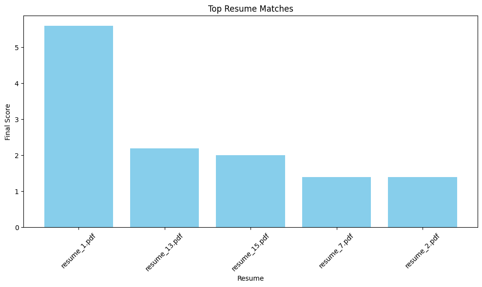

markdown
# Resume Analyzer

Resume Analyzer is a professionally designed NLP-powered application that analyzes resumes and matches them to a job description. Built with Python and Streamlit, it extracts relevant skills, scores resumes based on semantic alignment, and visualizes top candidates for efficient evaluation.

## Features

- Extracts skills and entities from PDF resumes using spaCy
- Matches resumes to job descriptions using semantic phrase overlap
- Scores and ranks resumes based on relevance
- Visualizes top matches with a bar chart

## Visualization



## Technologies Used

- Python
- Streamlit
- spaCy
- pandas
- matplotlib
- PyMuPDF

## Files Included

- `app.py` – Main application script
- `requirements.txt` – Dependency list
- `visualization.png` – Resume match chart
- `README.md` – Project documentation

## How It Works

1. Upload multiple PDF resumes
2. Paste a job description into the input field
3. Click "Analyze" to extract skills and compute match scores
4. View ranked results and a visual summary of top matches

## Usage

To run the application locally:

```bash
streamlit run app.py
```

Ensure all dependencies listed in `requirements.txt` are installed.

*License*

This project is released under the MIT License.
